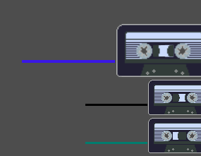

# TODO

fix det her:

- 
- imports i github action ([ref](https://github.com/bjornarprytz/its-dangerous-to-go-alone-take-this/actions/runs/4641630764/jobs/8214797512))

## Game

- Run out of music
- End game
  - Loss condition (Eaten by beasts)
  - Win Screen
- Level Design
  - Intro
    - Get boomblaster
    - Get warning
    - Get direction
  - Danger
    - Meet wolves
    - Get first tape
  - Open (Find cave entrance)
    - Lake
    - Cabin
  - Cave
    - Statue
  - Freedoom
  - Wolves
  - Lake, Cabin

## Sprites

- Player sprite (Character)
  - animation
- Helper sprite (Character)
  - animation
- River tiles
- Nøkken

## Sound

- Dialogue sound
- Plukke opp kasett
- ++ songs

## Map

- Points of interest
  - Lake
  - House with cozy lights on
  - River
  - Ancient Overgrown Statue

## Nice to have

- Trees
  - Various sprites
  - Various sizes
  - Animation
- Boomblaster UI element
  - Insert casette animation
  - Running out of tape animation
- Nøkken
  - Logic
  - Sprite
